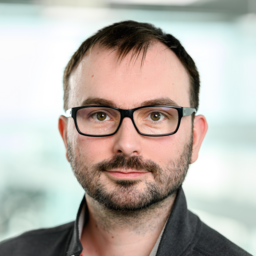

# Sebastian Lech
Salesforce Developer

  <a href="mailto:lechum2@gmail.com">lechum2@gmail.com</a>
| <a href="https://github.com/lechum2">GitHub</a>
| <a href="https://trailblazer.me/id/lechum2">Trailblazer</a>
| <a href="https://www.linkedin.com/in/sebastian-lech-9054ab78">LinkedIn</a>

I am en experienced developer with computer science education, background in C++, C# and web development.
Currently I am focusing on Salesforce technologies. Bringing the value to business without reinventing the wheel.\
I am passionate about security, linux and boardgames. Also practicing tai-chi.

Native Polish, fluent English speaker. Currently residing in Warsaw Poland.

## Experience
`2023` *BEC Poland*\
Working as a Salesforce DevOps Engineer. Facilitating move to more refined deployment process for a large in-house Salesforce implementation. Increasing both quality and reliability of the solution.

`2018 - 2022` *Cloudity Sp z o. o.*\
Almost 5 years as a **Salesforce Developer**. Working with both small and large platform implementations. Custom solutions for multiple clouds and package development. Various integrations both inbound and outbound, also using Platform Events. Utilizing Heroku as en extension of platform capabilities.

`2013 - 2018` *Hypermedia Sp z o. o.*\
1 year as **Technology Team Lead**. Leading a 12-person team in creation and constant development of applications for one large client.\
3 years as **Senior .NET Developer**. Creation an maintenance of web applications in .NET technologies. Supervising projects development. Introducing git control version system and training people to use it.

`2009 - 2013` *Transition Technologies S.A.*\
0,5 year of working in a project incorporating applications in different technologies: C#, C++, Visual Basic and Java.\
2 years as a **C# developer**. Migrating and then developing application on .Net platform with a web interface.\
1,5 year as a **C++ developer**. Maintenance and development of business application server and client application with interface in Qt.

## Certification
`Nov 2022` Salesforce Certified Platform Developer II

`Oct 2018` Salesforce Certified Platform Developer I

`Sep 2020` MuleSoft Certified Developer - Level 1 (Mule 4) - expired

## Education
`2013 – 2015` Warsaw School of Information Technology\
Non-stationary course in Computer Science.	

`2003 – 2012` Warsaw University of Technology\
Course in Computer Science on The Faculty of Mathematics and Information Science in English

<!-- ### Footer

Last updated: May 2013 -->

